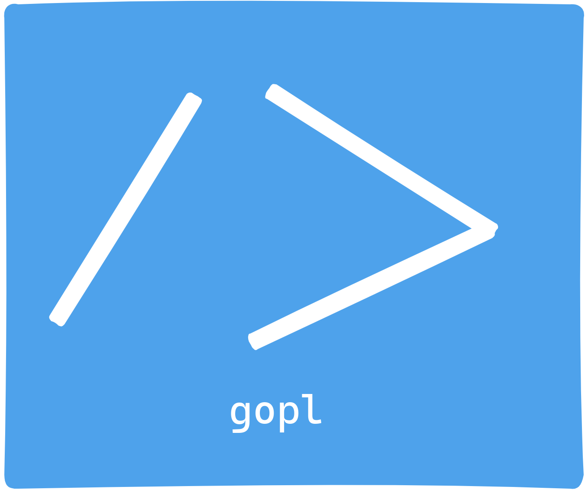

# Go API Project Structure CLI Documentation

Welcome to the Go API Project Structure CLI (gopl) documentation. This command-line tool allows you to create a new Go API project structure quickly and efficiently. It offers you the flexibility to configure the project with or without Docker.

> This is just a quick CLI Hack I came up with to help me structure my API for a pet project I am doing and also sicne I am learning GO I will be needing this. <br> Feel free to add changes to this. It is mainly tailored to my liking and current knowledge of go <br>

> Make sure to run this if you are lazy to run `go build`

```
./set-build
```

## Table of Contents

1. [Installation](#installation)
2. [Usage](#usage)
3. [Command Overview](#command-overview)
   - [Create](#create-command)
4. [Project Structure](#project-structure)
5. [Configuration](#configuration)
6. [Examples](#examples)
7. [Contributing](#contributing)
8. [License](#license)

## Installation <a name="installation"></a>

Before using the Go API Project Structure CLI, you must install it. You can do this by running the following command:

```shell
go get github.com/shadmeoli/gopl
```

Ensure that your Go environment is set up correctly before proceeding.

## Usage <a name="usage"></a>

To use the CLI, run the `gopl` command followed by a specific sub-command. The primary sub-command is `create`, which generates a new Go API project structure.

```shell
gopl create --project-name myapi
```

## Command Overview <a name="command-overview"></a>

### Create <a name="create-command"></a>

The `create` command is the main functionality of this CLI. It allows you to create a new Go API project structure.

#### Usage

```shell
gopl create [flags]
```

#### Flags

- `--project-name, -p`: Specify the name of the project directory.
- `--use-docker, -d`: Configure Docker for the project (optional).

## Project Structure <a name="project-structure"></a>

The CLI will generate a well-organized project structure for your Go API project. This structure includes directories and files such as:

- `cmd/myapi`: Main application entry point.
- `internal/api/handlers`: API request handlers.
- `internal/app/config`: Configuration files.
- `internal/app/database/postgres`: Database configuration (PostgreSQL).
- `internal/app/middleware`: Middleware components.
- `api/v1/routes`: API routes.
- `scripts`: Custom scripts.
- `web`: Web-related assets and files.
- `Dockerfile`: Docker configuration (if Docker is enabled).
- `go.mod` and `go.sum`: Go module files.
- `README.md`: Project documentation.

## Configuration <a name="configuration"></a>

You can configure your project by creating a `.env` file in your project directory. The CLI will prompt you to create this file during project structure generation. This file can store environment-specific configuration variables. An example `.env` file content is as follows:

```shell
# Environment Configuration
DATABASE_URL=your_database_url
SECRET_KEY=your_secret_key
# Add other environment variables here
```

## Examples <a name="examples"></a>

Here are some examples of using the Go API Project Structure CLI:

1. Create a project named "myapi" without Docker:

```shell
gopl create --project-name myapi
```

2. Create a project named "myapi" with Docker configuration:

```shell
gopl create --project-name myapi --use-docker
```

## Contributing <a name="contributing"></a>

We welcome contributions to this open-source project. If you have suggestions, bug reports, or want to add new features, please check the project repository on GitHub.

## License <a name="license"></a>

This CLI is open-source and distributed under the [MIT License](https://opensource.org/licenses/MIT). You are free to use, modify, and distribute it as per the license terms.

---

Thank you for using the Go API Project Structure CLI. We hope this tool makes it easier for you to start new Go API projects and accelerates your development process. If you have any questions or need further assistance, please refer to the project's documentation or GitHub repository for support.
